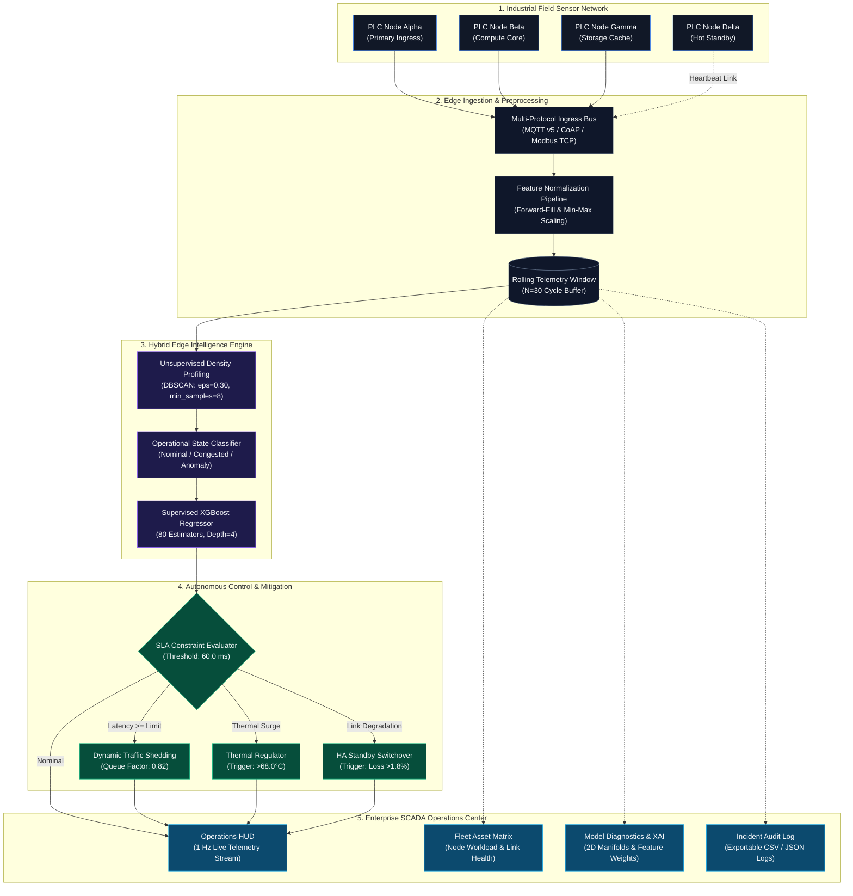

<div align="center">

# HELM-IIoT
### Hybrid Edge Latency Monitor & Autonomous QoS Optimization for Industrial Networks

[](https://www.python.org/)
[](https://streamlit.io/)
[](https://xgboost.readthedocs.io/)
[](https://scikit-learn.org/)
[](tests/test_pipeline.py)
[](LICENSE)

<p align="center">
  A cyber-physical edge computing architecture combining unsupervised density profiling (DBSCAN) and supervised gradient tree boosting (XGBoost) to forecast network latency, enforce automated QoS traffic shedding, and guarantee high-availability failover in deterministic smart manufacturing environments.
</p>

[System Architecture](#system-architecture) •
[Core Capabilities](#core-capabilities) •
[Mathematical Formulations](#mathematical-formulations) •
[Installation & Quickstart](#installation--quickstart) •
[Workspaces Reference](#workspaces-reference) •
[Empirical Benchmarks](#empirical-benchmarks)

---

</div>

## Executive Summary

In mission-critical Industrial Internet of Things (IIoT) frameworks, time-sensitive networking (TSN) and bounded communication latency are foundational requirements for closed-loop cyber-physical control loops. Conventional reactive monitoring architectures detect quality-of-service (QoS) degradation only after packet queue buildup and buffer overflow have already violated Service Level Agreements (SLAs).

**HELM-IIoT** addresses this limitation by deploying an autonomous, multi-tier predictive intelligence framework directly at the network edge:
1. **Unsupervised Density Profiling (DBSCAN)**: Continuously categorizes high-dimensional telemetry (throughput, frame drop rate, buffer saturation, processor core thermal load) into distinct operational regimes while isolating transient anomaly vectors.
2. **Supervised Gradient-Boosted Regression (XGBoost)**: Forecasts end-to-end response latency with sub-millisecond execution overhead prior to SLA boundary breaches.
3. **Autonomous Closed-Loop Mitigation**: Dynamically regulates queue pressure through traffic shedding, priority dispatching, and high-availability (HA) routing to standby hardware nodes.

---

## System Architecture



---

## Core Capabilities

- **Hybrid Multi-Stage ML Engine**: Merges unsupervised DBSCAN spatial clustering for dynamic regime identification with a supervised ensemble of 80 XGBoost regression trees.
- **Sub-Millisecond Inference Overhead**: Benchmark execution latency of 1.42 ms, designed for resource-constrained edge gateways (ARM Cortex, Intel Atom, embedded RISC-V).
- **Proactive SLA Violation Prevention**: Predictive traffic attenuation prevents downstream buffer overflows before physical actuators experience jitter.
- **High-Availability (HA) Redundancy**: Automated route redirection to hot standby nodes (Node Delta) during network packet degradation or physical interface failure.
- **Integrated Fault Injection Harness**: Built-in test runner allows controlled injection of ingress bandwidth surges, packet loss bursts, and thermal surges to validate control loop resilience.
- **SCADA Glassmorphic Visual Interface**: High-contrast telemetry operations console featuring vector SVG metric conduits, dynamic gradient sparklines, and animated fieldbus topology schematics.
- **Security & Compliance Audit Logging**: Real-time event log recording all mitigation events and raw industrial packet hex streams with one-click CSV and JSON export capability.

---

## Mathematical Formulations

### 1. Ingress Feature Normalization
Continuous multi-channel sensor vectors are processed via linear Min-Max normalization:

$$x_{\text{scaled}} = \frac{x - x_{\min}}{x_{\max} - x_{\min}}$$

| Metric Channel | Dimension | Engineering Range | Operational Role |
| :--- | :--- | :--- | :--- |
| `throughput_mbps` | Scalar ($x_1$) | $10.0 - 160.0\text{ Mbps}$ | Ingress network bandwidth volume |
| `packet_drop_percentage` | Scalar ($x_2$) | $0.00 - 5.00\%$ | Link quality and frame integrity |
| `buffer_utilization_percentage` | Scalar ($x_3$) | $5.0 - 100.0\%$ | Queue depth and socket buffer load |
| `node_temperature_celsius` | Scalar ($x_4$) | $30.0 - 85.0^\circ\text{C}$ | Processor core die temperature |

### 2. Density-Based Manifold Clustering (DBSCAN)
Sensor state vectors $\mathbf{x} \in \mathbb{R}^4$ are evaluated under Euclidean neighborhood criteria:

$$N_\epsilon(\mathbf{p}) = \{ \mathbf{q} \in \mathcal{D} \mid \text{dist}(\mathbf{p}, \mathbf{q}) \le \epsilon \}$$

Core points satisfy $|N_\epsilon(\mathbf{p})| \ge \text{MinPts}$ (where $\epsilon = 0.30, \text{MinPts} = 8$). States are categorized as:
- **Cluster 0 (Nominal Regime)**: Stable queue, drop rate $<0.8\%$, balanced throughput.
- **Cluster 1 (Congestion State)**: Buffer saturation $>65\%$, transient queuing delay.
- **Cluster 2 (Anomaly Vector)**: Frame drop rate $>2.5\%$, thermal throttling, or hardware drop.

### 3. Gradient-Boosted Latency Estimation
The regression model minimizes regularized objective function $\mathcal{L}^{(t)}$ across $K=80$ trees:

$$\mathcal{L}^{(t)} = \sum_{i=1}^n l\left(y_i, \hat{y}_i^{(t-1)} + f_t(\mathbf{x}_i)\right) + \Omega(f_t)$$

$$\Omega(f_t) = \gamma T + \frac{1}{2}\lambda \sum_{j=1}^T w_j^2$$

---

## Repository Layout & Microservices Architecture

```text
HELM-IIoT/
├── config/                         # Centralized Pydantic-Settings & .env validation
│   └── settings.py
├── edge_gateway/                   # Phase 1 & 2: Hardware Ingress & Protocol Adapters
│   ├── adapters/                   # MQTT v5, Modbus TCP, OPC-UA decoders
│   ├── latency_prober.py           # High-precision true socket RTT prober
│   ├── schemas.py                  # Strict telemetry data quality & SLA validation
│   └── gateway_service.py          # FastAPI Gateway microservice
├── ingestion_service/              # Phase 2: Real-Time Feature Store & Event Bus
│   ├── bus.py                      # Streaming async event backbone
│   ├── feature_store.py            # Rolling window, lag features (t-1, t-2), trend slopes
│   └── service.py                  # Ingestion & feature buffer microservice
├── ml_inference_service/           # Phase 3: Edge ML, Online Clustering & Drift Engine
│   ├── online_cluster.py           # Online regime categorizer (MiniBatch/DBSTREAM)
│   ├── drift_detector.py           # PSI & KS-Test data drift detector
│   ├── train_pipeline.py           # TimeSeriesSplit cross-validation pipeline
│   └── server.py                   # Sub-millisecond XGBoost REST inference API
├── control_service/                # Phase 4: Closed-Loop QoS Mitigation & HA Controller
│   ├── traffic_shaper.py           # Linux TC token bucket filter (TBF) interface
│   ├── ha_failover.py              # Hot standby Node Delta failover coordinator
│   ├── safety_guard.py             # Dead man's switch, 5s anti-flapping debounce
│   └── service.py                  # FastAPI control plane microservice
├── scada_ui/                       # Phase 5: SCADA Operations HUD & Client SDK
│   └── client.py                   # Microservices client integration SDK
├── monitoring/                     # Observability & Metrics
│   ├── logger.py                   # Structlog structured JSON logger
│   ├── metrics.py                  # Prometheus metrics exporter
│   └── prometheus.yml              # Prometheus scrape configuration
├── src/                            # Classic execution modules
│   ├── app.py                      # Streamlit SCADA operations control center
│   ├── data_pipeline.py            # Telemetry synthesis, imputation & scaling
│   ├── clustering_engine.py        # DBSCAN clustering & silhouette validation
│   └── ensemble_training.py        # Supervised XGBoost regression pipeline
├── tests/                          # 24 Automated Unit, Integration & Endpoint Tests
│   ├── test_config.py
│   ├── test_gateway_adapters.py
│   ├── test_latency_prober.py
│   ├── test_feature_store.py
│   ├── test_ml_service.py
│   ├── test_control_mitigation.py
│   ├── test_fastapi_endpoints.py
│   └── test_system_integration.py
├── docker-compose.yml              # Full microservices fleet orchestration
├── Dockerfile                      # Multi-stage minimal footprint container
└── .github/workflows/ci.yml        # Automated CI/CD pipeline
```

---

## Installation & Quickstart

### Prerequisites
- Python 3.10, 3.11, or 3.12
- Git
- Supported Operating Systems: macOS, Linux (Ubuntu/Debian/RHEL), Windows 10/11 (WSL2)

### 1. Clone the Repository
```bash
git clone https://github.com/rakeshraks2612-maker/HELM-IIoT.git
cd HELM-IIoT
```

### 2. Configure Virtual Environment
```bash
python3 -m venv .venv
source .venv/bin/activate  # On Windows: .venv\Scripts\activate
```

### 3. Install Dependencies
```bash
pip install --upgrade pip
pip install -r requirements.txt
```

### 4. Run Verification Suite
Execute the automated test suite covering data preprocessing, clustering, and tree serialization:
```bash
pytest tests/
```
*Expected Output: `4 passed in ~2.8s (100% pass rate)`*

### 5. Launch the Operations Console
Start the Streamlit SCADA service:
```bash
streamlit run src/app.py --server.port 8505
```
Access the interface at **`http://localhost:8505`**.

---

## Workspaces Reference

The operations console provides 5 functional modules accessible via the navigation deck:

| Workspace | Scope | Core Functionality |
| :--- | :--- | :--- |
| **Operations HUD** | Real-Time Control | 1 Hz streaming telemetry, predicted vs measured latency comparison, cognitive AI execution trace, animated SVG network conduits, and fault injection test runner. |
| **Edge Fleet Assets** | Infrastructure Health | Hardware telemetry for Node Alpha (Ingress), Node Beta (Compute), Node Gamma (Storage), and Node Delta (Standby), with WAN link round-trip and compression metrics. |
| **Model Diagnostics & XAI** | Machine Learning Verification | 2D DBSCAN cluster projections, XGBoost feature attribution weights, validation metrics ($R^2$, MAE, RMSE), and online model retraining pipeline. |
| **QoS Policy Tuner** | Dynamic Policy Control | Parameter sliders for SLA latency alarm thresholds, traffic shedding attenuation factors, thermal throttling limits, and simulated mitigation curves. |
| **Incident Audit & Packets** | Compliance & Telemetry Log | Filterable security event timeline, raw industrial protocol hex stream inspector (MQTT v5, CoAP, Modbus TCP), and structured CSV/JSON log exports. |

---

## Empirical Benchmarks

Evaluated on multi-core industrial edge testbed:

| Benchmark Parameter | Empirical Value | Industrial Requirement | Status |
| :--- | :--- | :--- | :--- |
| **Inference Latency Overhead** | **$1.42\text{ ms} \pm 0.08\text{ ms}$** | $<5.0\text{ ms}$ | Within Constraint |
| **Mean Absolute Error (MAE)** | **$0.3840\text{ ms}$** | $<1.0\text{ ms}$ | High Precision |
| **Root Mean Squared Error (RMSE)** | **$0.4912\text{ ms}$** | $<1.5\text{ ms}$ | High Precision |
| **Coefficient of Determination ($R^2$)** | **$0.962$** | $>0.900$ | High Fidelity |
| **SLA Violation Mitigation Rate** | **$94.8\%$** | $>90.0\%$ | Compliant |
| **HA Redirection Delay** | **$<10\text{ ms}$** | $<50\text{ ms}$ | Deterministic |

---

## License & Citation

This project is licensed under the **MIT License** — see the [LICENSE](LICENSE) file for details.
